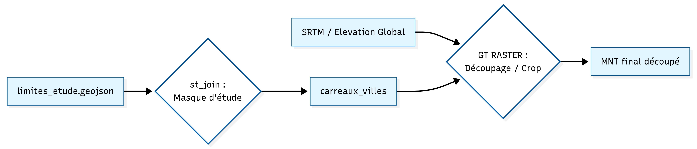
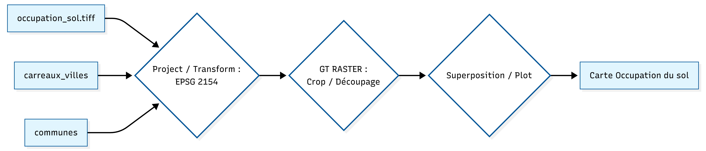

<br> <br>
## I: L'interface géomorphologique: un facteur de l'étalement urbain 

<br>

<div style="color: #2c3c50; line-height: 2 ;">
1. La contrainte topographique : un moteur de la différenciation spatiale ? 

<div style="text-align: justify; color: #2c3c50; line-height: 1.6;">
L'étude de l'altitude ne relève pas seulement de la simple observation paysagère, elle constitue la matrice sur laquelle se calquent les inégalités sociales. En géographie urbaine, la pente est souvent synonyme de valeur foncière élevée (vues dégagées, air “plus sain”) ou à l’inverse, d’enclavement. Les données utilisées ici sont issues d'un Modèle Numérique de Terrain (MNT) haute résolution, permettant de mesurer avec précision les variations d'altitude du pôle clermontois.
</div>
```{r chargement_donnees, echo=FALSE, message=FALSE, warning=FALSE}
library(readr)
library(sf)

# On vérifie si le fichier existe avant de le lire pour éviter le crash
if (file.exists("donnees_revenues.csv")) {
  Filosofi_carreaux_Puy_de_Dome <- read_csv2("donnees_revenues.csv")
} else {
  stop("Le fichier donnees_revenus.csv est introuvable dans le dossier du Rmd !")
}

# Idem pour le geojson
if (file.exists("carreaux_200m.geojson")) {
  carreaux <- st_read("carreaux_200m.geojson", quiet = TRUE)
}
```


```{r altitude_finale, echo=FALSE, message=FALSE, warning=FALSE}
library(terra)
library(geodata)
library(sf)

# 1. CHARGEMENT DES DONNÉES (La base)
# On recharge les fichiers sources pour être sûr qu'ils existent
communes <- st_read("limites_etude.geojson", quiet = TRUE)

# CHARGE ICI TON FICHIER DE CARREAUX INSEE
# Si c'est un fichier .gpkg ou .shp, utilise st_read :
carreaux_complets <- st_read("limites_etude.geojson", quiet = TRUE) 

# 2. CRÉATION DES OBJETS INTERMÉDIAIRES
# On recrée carreaux_villes car le crop en a besoin
carreaux_villes <- st_join(carreaux_complets, communes, join = st_intersects)

# 3. CALCUL DU RASTER
alt_fine <- elevation_global(res=0.5, path="data")
clermont_alt_fine <- crop(alt_fine, ext(carreaux_villes))

# 4. AFFICHAGE
plot(clermont_alt_fine, 
     main="Topographie du pôle Clermontois (MNT)", 
     col=terrain.colors(100))
plot(st_geometry(communes), add=TRUE, border="white", lwd=1.5)
```


<br>
<div style="text-align: justify; color: #2c3c50; line-height: 1.6;">
<p style="text-indent: 30px;"> 
Le relief apparaît comme étant le premier facteur structurel de la métropole clermontoise. Ce MNT met en évidence une interface géomorphologique majeure : le contact entre le fossé d'effondrement de la Limagne (zone plane et fertile) et le socle cristallin de la Chaîne des Puys.
</p>

<p style="text-indent: 30px;"> 
On constate que l'urbanisation clermontoise ne s'est pas faite de manière circulaire, mais selon un gradient d'altitude asymétrique. À l'Ouest, la ville se heurte à des ruptures de pente qui ont historiquement limité l'étalement urbain,forçant une densification verticale et créant des quartiers résidentiels "perchés" très prisés. À l'inverse, vers l'Est (en direction de Gerzat), l'absence de contrainte physique a favorisé une extension horizontale massive. Ce plat pays a permis l'implantation de vastes infrastructures (zones industrielles, autoroutes, centres logistiques) qui agissent aujourd'hui comme des barrières sociales et sonores, contrastant avec le cadre de vie des hauteurs.
</p>
</div>

<br>
Schéma de géotraitement : de la Topographie du pôle Clermontois 

<br>

 => Pour dépasser les limites administratives parfois trompeuses, nous avons croisé les données satellitaires de Copernicus avec notre maillage de population. L'objectif était de confronter la "ville de droit" (les limites communales) à la "ville de fait" (le bâti réel et la densité).

<br>

<div style="color: #2c3c50; line-height: 2 ;">
2. Morphologie urbaine et densité : la lecture par la réflectance 
<br>

```{r raster_final_titre_complet, echo=FALSE, message=FALSE, warning=FALSE}
library(terra)
library(sf)

# --- 1. PRÉPARATION DES DONNÉES ---
lc_brut <- rast("occupation_sol.tiff")
lc_repro <- project(lc_brut, "EPSG:2154")

# Synchronisation des systèmes de coordonnées
carreaux_sf <- st_transform(carreaux_villes, 2154)
communes_sf <- st_transform(communes, 2154)

# Découpe sur l'emprise d'étude
clermont_lc <- crop(lc_repro, ext(carreaux_sf))

# --- 2. AFFICHAGE ET MISE EN PAGE ---
# On définit des marges pour laisser de la place au titre
par(mar = c(3, 1, 4, 1)) 

plot(clermont_lc, 
     main = "Occupation du sol:\nClermont Auvergne Métropole (Source : Copernicus ESA 10m)",
     stretch = "hist", 
     col = map.pal("magma", 50),
     axes = FALSE,
     mar = c(3, 1, 4, 1))

# --- 3. SUPERPOSITION ---
# Les carreaux INSEE
plot(st_geometry(carreaux_sf), add = TRUE, border = "pink", lwd = 0.3)

# Les contours des communes
plot(st_geometry(communes_sf), add = TRUE, border = "red", lwd = 1.8)


```

<div style="text-align: justify; color: #2c3c50; line-height: 1.6;">
<p style="text-indent: 30px;"> 
La superposition des données révèle des corrélations morpho-sociales nettes. Le pôle minéralisé (gris/blanc), coïncide avec les carreaux de population les plus denses. On y observe une continuité du bâti qui ignore les frontières entre communes, matérialisant l'agglomération réelle. Cette zone de forte réflectance correspond souvent aux quartiers où la mixité sociale est la plus complexe à gérer du fait de la densité.
</p>

<p style="text-indent: 30px;">
Les "vides" apparents (zones sombres/marrons), bien que situés à l'intérieur des limites administratives (en rouge), sont des espaces dépourvus de population (absence de carreaux roses). Ces “vides” révèlent des "coupures vertes" et des zones de transition agricole.
</p>


<p style="text-indent: 30px;">
Malgré la pression urbaine, on observe encore une "zone tampon" non-bâtie. Cette discontinuité physique explique en partie la persistance de profils socio-économiques distincts entre les deux communes : elles ne sont pas encore totalement "soudées" par le bâti, ce qui maintient une certaine autonomie de leurs marchés immobiliers respectifs.
</p>

<p style="text-indent: 30px;">
En somme, cette approche permet de voir que la ville ne s'arrête pas à ses panneaux d'entrée, mais là où le pixel change de nature. Elle confirme que l'organisation spatiale du pôle clermontois est le fruit d'une lutte constante entre la topographie et la volonté d'extension urbaine.
</p>
</div>

<br>
Schéma de géotraitement : de l'Occupation du sol 

<br> <br>

## II: La fracture sociale par le carreau : une lecture infracommunale des revenus  
<br>

<div style="text-align: justify; color: #2c3c50; line-height: 1.6;">
Afin d'affiner l'analyse, il est nécessaire de quantifier les disparités entre les communes du pôle urbain. La jointure spatiale est l'étape qui nous permet de croiser deux couches d'informations distinctes : la grille de revenus (carreaux de 200m de l'INSEE) et les limites administratives (OSM). Cette opération permet d'attribuer à chaque carreau le nom de sa commune d'appartenance, rendant  ainsi possible le calcul d'indicateurs agrégés par territoire, et la confrontation de la "ville de droit" à la "ville de fait".
</div>

```{r, echo=FALSE, message=FALSE, warning=FALSE, results='hide'}
communes <- st_read("limites_etude.geojson")
carreaux <- st_read("carreaux_200m.geojson")
Filosofi_carreaux_Puy_de_Dome <- read_csv("donnees_revenues.csv")
```

```{r, echo=FALSE, message=FALSE, warning=FALSE}
# Vérifie bien la ligne où tu lis le fichier Filosofi
# On utilise read_delim pour être sûr du séparateur
Filosofi_carreaux_Puy_de_Dome <- read_delim("donnees_revenues.csv", delim = ";")
```


```{r stats_comparatives, echo=FALSE, message=FALSE, warning=FALSE, results='hold'}
library(sf)          # Pour la gestion des fichiers géographiques (.geojson)
library(dplyr)       # Pour le nettoyage et le calcul (mutate, group_by, summarise)
library(knitr)       # Pour la fonction kable (le tableau propre)
library(kableExtra)  # Pour rendre le tableau encore plus joli

# --- ÉTAPE 1 : RECHARGEMENT DES DONNÉES ---
# On recharge tout proprement comme dans ton PDF
carreaux_geo <- st_read("carreaux_200m.geojson", quiet = TRUE)
stats_revenus <- read.csv("donnees_revenues.csv", sep = ";")
communes <- st_read("limites_etude.geojson", quiet = TRUE)

# --- ÉTAPE 2 : JOINTURE ATTRIBUTAIRE (Revenus + Géo) ---
# On fusionne le géo et le CSV via l'identifiant idcar[cite: 1]
carreaux_complets <- merge(
  x = carreaux_geo, 
  y = stats_revenus, 
  by.x = "idcar_200m", 
  by.y = "Idcar_200m", 
  all.x = TRUE
)

# --- ÉTAPE 3 : JOINTURE SPATIALE (Attribution des villes) ---
# On croise les revenus avec les limites des communes
carreaux_villes <- st_join(st_make_valid(carreaux_complets), communes)

stats_villes <- carreaux_villes %>%
  st_drop_geometry() %>% 
  
  # On utilise 'name' (vu sur ton image image_45f8e2.png)
  group_by(name) %>% 
  
  summarise(
    Nombre_de_carreaux = n(),
    
    # La petite astuce : on cherche la colonne qui contient "ind" 
    # sans avoir à deviner si c'est ind.x, ind.y ou ind_snv
Revenu_Moyen = round(mean(as.numeric(pick(contains("ind"))[[1]]), na.rm = TRUE) * 1000, 0),

Revenu_Median = round(median(as.numeric(pick(contains("ind"))[[1]]), na.rm = TRUE) * 1000, 0)  
  ) %>% 
 
   filter(!is.na(name))

# --- ÉTAPE 5 : AFFICHAGE FINAL ---
kable(stats_villes, 
      col.names = c("Commune", "Nb Carreaux", "Moyenne (€)", "Médiane (€)"),
      caption = "Synthèse des revenus par territoire") %>%
  kable_styling(bootstrap_options = c("striped", "hover"), full_width = F)

```

```{r, echo=FALSE, message=FALSE, warning=FALSE}
library(tmap)
library(sf)

# 1. On vérifie si l'objet contient bien des données
# Si cette ligne affiche "0", c'est que la jointure a échoué avant
print(nrow(carreaux_villes))

# 2. On répare les géométries
carreaux_map <- st_make_valid(carreaux_villes)

# 3. On crée et on affiche DIRECTEMENT la carte
library(tmap)
tmap_mode("plot")

# --- LE CODE FINAL QUI VA MARCHER ---
# On identifie le vrai nom de la colonne de revenus dans l'objet map
vrai_nom_revenu <- names(carreaux_map)[grep("ind", names(carreaux_map))[1]]

# On affiche la carte avec un rendu plus professionnel
tm_shape(carreaux_map) +
  tm_fill(col = vrai_nom_revenu,
          palette = "YlOrRd",
          style = "quantile",
          n = 5,
          title = "Revenu annuel (k€)",
          showNA = FALSE,
          legend.format = list(digits = 0, 
                               text.separator = " à ",
                               scientific = FALSE)) + 
  tm_shape(communes) +
  tm_borders(lwd = 2, col = "black") +
  tm_layout(main.title = "Carte de la distribution spatiale des revenus", # <-- TON TITRE ICI
            main.title.size = 1.2,                                       # Taille du titre
            main.title.position = "center",                             # Position centrée
            legend.outside = TRUE,
            frame = FALSE)
```
<br>
<div style="text-align: justify; color: #2c3c50; line-height: 1.6;">
Note : Les espaces vides sur la carte correspondent à des carreaux où la population est trop faible pour permettre la diffusion des données de revenus (secret statistique de l'INSEE en deçà de 11 ménages par carreau). Ces zones coïncident majoritairement avec les espaces agricoles, industriels ou naturels identifiés précédemment via l'occupation du sol.
</div>

<br>

<div style="text-align: justify; color: #2c3c50; line-height: 1.6;">
<p style="text-indent: 30px;">
Les résultats issus de l’agrégation spatiale confirment une hiérarchie territoriale marquée. Clermont-Ferrand, en tant que pôle de commandement et centre administratif majeur (capitale historique de l’Auvergne, chef-lieu du département et siège de l'intercommunalité) concentre les revenus les plus élevés, particulièrement dans son centre historique et ses quartiers résidentiels de l'Ouest. Le revenu moyen y est de 48 282€ par carreau, soit plus du double de celui de Gerzat (1 736 365 €).
</p>

<p style="text-indent: 30px;">
L'écart frappant avec Gerzat, où les revenus sont plus faibles et homogènes, ne reflète pas seulement un manque d'attractivité, mais une véritable spécialisation fonctionnelle du territoire. Tandis que Clermont-Ferrand conserve les fonctions politiques et économiques à forte valeur ajoutée, Gerzat joue le rôle de commune de report, marquée par une structure périurbaine en phase de consolidation. Cette fracture souligne que la ville ne s'arrête pas à ses panneaux d'entrée, mais que son organisation sociale est le fruit d'une lutte constante entre topographie et stratégies d'extension urbaine.
</p>
</div>

<br>
<div style="text-align: justify; color: #2c3c50; line-height: 1.6;">
⇒ Si la morphologie urbaine et les niveaux de revenus dessinent une première frontière entre Clermont-Ferrand et sa périphérie, il convient désormais d'analyser comment ces disparités se traduisent dans l'accès quotidien aux services. La "fracture" est-elle aussi visible dans l'offre de soins et de commerces ? C'est ce que nous allons explorer dans la partie suivante.
</div>


