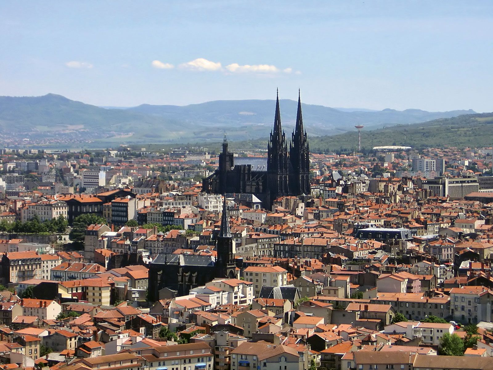
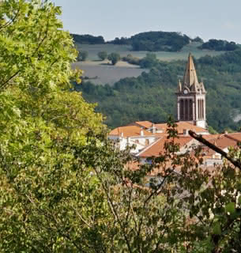
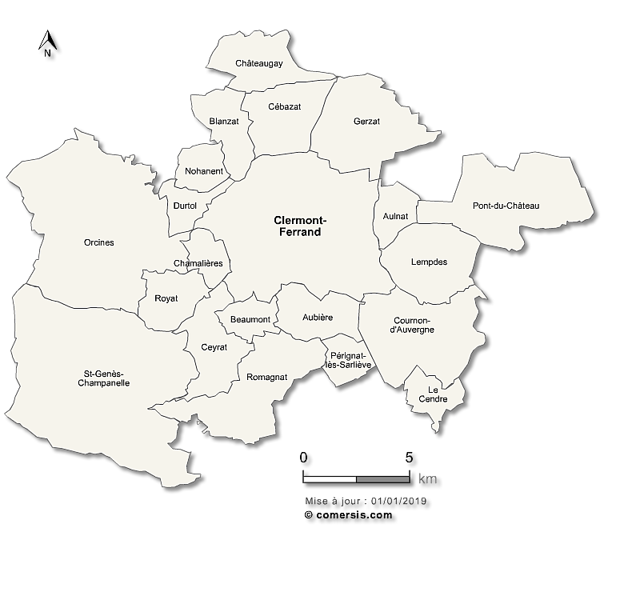

# Bienvenue sur notre projet

Étude réalisée par Abigaelle Camara et Vadim Tank-Solodkiv.

   
Sommaire de l'étude:

1. [Page 2 : Analyse de la Topographie et Relief](analyse_sociale.html)
   *Étude du relief du pôle Clermontois via MNT.*

2. [Page 3 : État des lieux des Services Publics](page_3_services.html)
   *Cartographie de l'offre globale (santé, social, culture, éducation).*

3. [Page 4 : Diagnostic de Synthèse](page_4.html)
   *Croisement entre offre d'équipements et niveaux de vie pour identifier les zones de rupture.*
   
   
Territoires d'étude : Clermont-Ferrand et Gerzat

| Clermont-Ferrand | Gerzat |
|:---:|:---:|
|  |  |

⇒ Localisation de la zone d'étude dans le Puy-de-Dôme (63) en Auvergne-Rhône-Alpes.

⇒ Clermont-Ferrand et Gerzat à l'épreuve des inégalités territoriales

### Introduction

Le Puy-de-Dôme constitue un terrain d'étude particulièrement révélateur des dynamiques qui traversent les espaces urbains et périurbains français contemporains. Au cœur de ce département, Clermont-Ferrand s'impose comme une métropole régionale de premier plan : préfecture du département, capitale historique de l'Auvergne et siège de Clermont Auvergne Métropole, elle concentre les fonctions politiques, économiques et universitaires d'un bassin de vie qui dépasse largement ses seules limites administratives. 

Perchée à plus de 400 mètres d'altitude, à l'interface entre le fossé d'effondrement de la Limagne à l'est et le socle cristallin de la Chaîne des Puys à l'ouest, la ville présente une configuration géomorphologique singulière qui a profondément conditionné son développement urbain. Son identité est par ailleurs indissociable de l'héritage industriel du groupe Michelin, dont l'implantation massive a structuré pendant plus d'un siècle la géographie sociale de l'agglomération.

Immédiatement contiguë au nord-est de la ville-centre, Gerzat représente un profil radicalement différent. Commune périurbaine de première couronne comptant environ 11 000 habitants, elle s'étend sur la plaine de la Limagne dans une configuration topographique plane, sans rupture physique majeure avec le tissu urbain clermontois. Sa croissance démographique et résidentielle s'est largement construite en réaction aux dynamiques de la métropole voisine, faisant d'elle un espace de report urbain dont la morphologie sociale et fonctionnelle mérite d'être interrogée à l'aune de sa relation avec la ville-centre.

C'est précisément cette relation d'interface qui constitue le cœur de la présente étude. Dans un contexte de métropolisation croissante, la limite communale (outil de gouvernance et cadre juridique) tend à ne plus coïncider avec les réalités sociales et spatiales qu'elle est censée délimiter. Elle fige des frontières héritées là où les dynamiques de peuplement, de ségrégation résidentielle et d'accès aux équipements s'organisent selon des logiques propres, souvent indifférentes aux découpages administratifs. C'est cet écart entre la « ville de droit » et la « ville de fait » que ce travail cherche à mettre en lumière.

> **Problématique :** La frontière administrative entre Clermont-Ferrand et Gerzat cristallise-t-elle une rupture socio-spatiale, ou s'efface-t-elle derrière un continuum métropolitain ?

 

### Un dispositif méthodologique multidimensionnel:
Pour répondre à cette interrogation, l'étude mobilise un ensemble de données spatialisées traitées sous **RStudio**, articulant trois approches complémentaires :

 

*   **Analyse de la morphologie urbaine et physique :** Utilisation de données raster (MNT *geodata* et occupation du sol *Copernicus* à 10m) pour saisir les déterminants géomorphologiques.
*   **Analyse socio-économique infra-communale :** Exploitation des données carroyées **FILOSOFI (INSEE)** au maillage de 200m pour identifier les gradients de revenus indépendamment des limites administratives.
*   **Analyse fonctionnelle et d'accessibilité :** Mobilisation de la **Base Permanente des Équipements (BPE 2023)** et d'**OpenStreetMap** pour cartographier l'offre de soins, de culture et d'éducation.

 
⇒ Opérations géomatiques mobilisées :
   
Le passage de la donnée brute au diagnostic territorial repose sur trois piliers techniques :
1. **Analyses Rasters :** Caractérisation de l'environnement et lissage des données altimétriques.
2. **Jointures Spatiales et Attributaires :** Croisement des niveaux de vie et des géométries communales.
3. **Analyse Vectorielle (Zones tampons) :** Quantification de l'accessibilité aux services essentiels.

 
⇒ Liens institutionnels 
Pour plus d'informations sur les politiques locales et l'urbanisme de ces communes :
*   [Site officiel de la Ville de Clermont-Ferrand](https://www.clermont-ferrand.fr/)
*   [Site officiel de la Ville de Gerzat](https://www.ville-gerzat.fr/)
*   [Clermont Auvergne Métropole](https://www.clermontmetropole.eu/)  
   

---
**Découvrir l'analyse :**
[Passer à la Partie I : Analyse Géophysique](analyse_sociale.html)
