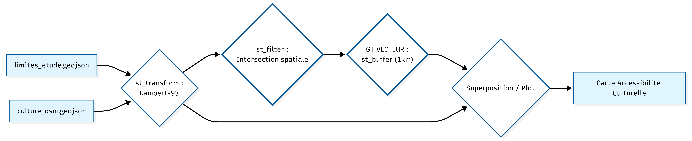
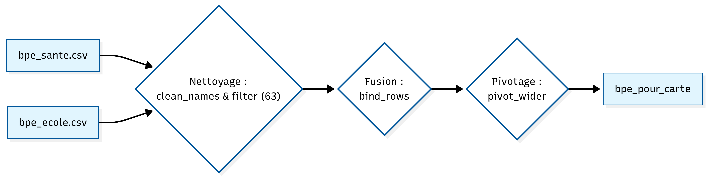
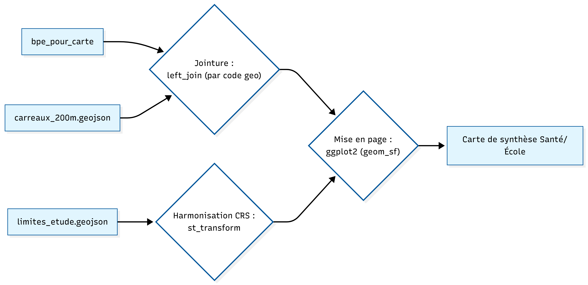
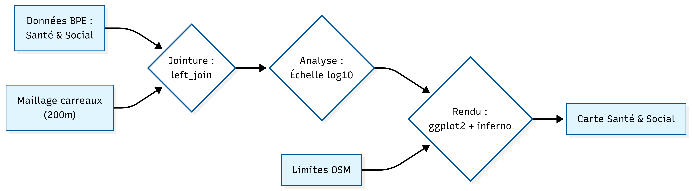

<br>

### I: Inégalités de richesse et disparités d'accès aux services 

<br>

<div style="color: #2c3c50; line-height: 2 ;">
1 : La construction du maillage socio-économique infra-communal 

Les données mobilisées : 

- la géométrie (couche vectorielle): un carroyage de 200 m (GeoJSON)

- les statistiques (données FILOSOFI): un tableau de revenus par carreau issu de l'INSEE (csv)

C'est une étape crutiale, car elle nous permet d'attribuer à chaque carreau ses données (revenu disponible). 

<br>

```{r, message=FALSE, warning=FALSE, result='asis'}

library(sf)
carreaux_geo <- st_read("carreaux_200m.geojson", quiet =TRUE)
stats_revenus <- read.csv("donnees_revenues.csv", sep = ";")
carreaux_complets <- merge(
x = carreaux_geo,
y = stats_revenus,
by.x = "idcar_200m",
by.y = "Idcar_200m",
all.x = TRUE
)

library(knitr)
tableau_final <- st_drop_geometry(head(carreaux_complets[, c("idcar_200m", "ind_snv", "men_prop")], 5))


kable(tableau_final, caption = "Extrait de la jointure attributaire")
carreaux_complets[is.na(carreaux_complets)] <- 0
```

Le tableau ci-dessus présente un extrait des 5 premiers carreaux enrichis. On y retrouve l'identifiant spatial, la somme totale des revenus disponibles (ind_snv) par carreau, et le nombre de ménages propriétaires (men_prop). 


```{r, message=FALSE, warning=FALSE}

summary(carreaux_complets$ind_snv)
nrow(carreaux_geo)      
nrow(carreaux_complets) 

```
<br>

<div style="color: #2c3c50; line-height: 2 ;">
2 : Une segmentation sociale héritée de l'histoire industrielle 
<br>

La carte ci-dessous est une projection spatiale des résultats de la jointure attributaire. Elle permet de visualiser instantanément la structure sociale du territoire.


```{r, message=FALSE, warning=FALSE}
library(tidyverse)
library(sf)

ma_carte_vecteur <- st_read("carreaux_200m.geojson", quiet =TRUE)
communes_osm <- st_read("limites_etude.geojson", quiet = TRUE)
communes_mask <- st_transform(communes_osm, st_crs(ma_carte_vecteur))

```


```{r, message=FALSE, warning=FALSE}

library(stars)
library(ggplot2)
library(viridis)

communes_mask <- st_transform(communes_osm, st_crs(ma_carte_vecteur))
raster_data <- st_rasterize(ma_carte_vecteur["ind_snv"], nx = 600, ny = 600)
raster_df <- as.data.frame(raster_data, xy = TRUE)
colnames(raster_df) <- c("x", "y", "valeur")

```


```{r raster_social_final_osm_propre, message=FALSE, warning=FALSE}

ggplot() +
  geom_raster(data = raster_df, aes(x = x, y = y, fill = valeur)) +
  
  geom_sf(data = communes_mask, fill = NA, color = "grey30", size = 0.05, alpha = 0.4) +
  
  scale_fill_viridis_c(
    option = "magma",
    name = "Niveau de vie (€)",
    na.value = "transparent",
    labels = function(x) paste0(format(x, big.mark = " ", scientific = FALSE), " €")
  ) +
  coord_sf() + 
  theme_void() + 
  theme(
    plot.title = element_text(size = 12, face = "bold", hjust = 0.5),
    plot.subtitle = element_text(size = 10, hjust = 0.5, margin = margin(b = 10)),
    legend.position = "right",
    plot.caption = element_text(size = 7, color = "gray50", hjust = 0.9)
  ) +
  labs(
    title = "Distribution spatiale du niveau de vie",
    subtitle = "Secteur: Clermont-Ferrand et sa péhriphérie Gerzat", 
    caption = "Source : Insee Filosofi & OpenStreetMap"
  )

```

<div style="text-align: justify; color: #2c3c50; line-height: 1.6;">
<p style="text-indent: 30px;"> 
  L’analyse statistique des 761 carreaux couvrant Clermont-Ferrand et Gerzat révèle des disparités de richesses extrêmes. Si le revenu médian par carreau s’établit à 2 721 695 €, l’écart abyssal entre le minimum (13 908 €) et le maximum (29 924 562 €) témoigne d’une concentration massive des revenus dans certains pôles. Loin d'être aléatoire, cette distribution suit une logique de segmentation spatiale très nette que la cartographie permet de décrypter.
</p> 

<p style="text-indent: 30px;">
  Aussi, la projection spatiale met en lumière une structure urbaine fortement contrastée. Les pôles de richesse (zones claires) se concentrent sur le centre-ville clermontois et s'étirent vers l'Ouest. Ce secteur, englobant les quartiers résidentiels historiques et les contreforts de la chaîne des Puys, demeure privilégié par les catégories socio-professionnelles supérieures. À l'inverse, les secteurs sombres dessinent une « ceinture » plus modeste à l'Est et au Nord-Est, où se superposent zones d'activités logistiques, axes autoroutiers et quartiers d'habitat social dense.
</p>

<p style="text-indent: 30px;">
  À l'échelle communale, Gerzat se distingue au Nord comme un pôle secondaire. Bien que parfaitement intégrée à la métropole, la commune présente une structure de revenus plus homogène et intermédiaire, caractéristique des villes de première couronne à dominante résidentielle.
</p>

<p style="text-indent: 30px;">
  Cette organisation trouve ses racines dans l'histoire industrielle de l'agglomération. Le développement de Clermont-Ferrand a longtemps été dicté par l'implantation des sites Michelin : l'Est a historiquement accueilli les populations ouvrières à proximité immédiate des usines, tandis que l'Ouest, protégé des nuisances industrielles par la topographie, a capté les fonctions de commandement et les populations les plus aisées.
</p>
</div>


<br> <br>


### II: L'accessibilité aux équipements: entre proximité et dépendance métropolitaine 
<br>

<div style="text-align: justify; color: #2c3c50; line-height: 1.6;">
Cette section analyse la capacité des habitants à accéder aux services essentiels. Pour les équipements culturels, nous utilisons une approche vectorielle par zones tampons (buffers) de 1 000 mètres, correspondant à environ 12 à 15 minutes de marche active. Pour la santé et l'enseignement, nous changeons d'échelle pour une analyse infracommunale par maillage de 200m, permettant d'observer la densité réelle des équipements au plus près du bassin de vie.
</div>
<br>

<div style="color: #2c3c50; line-height: 2 ;">
1 : Le pôle culturel: une barrière fonctionnelle au profit de la ville-centre


```{r cartographie_services_culturels, message=FALSE, warning=FALSE, results='hide'}
library(sf)
library(tidyverse)

communes_2154 <- st_read("limites_etude.geojson") %>% 
  st_transform(2154)

services_2154 <- st_read("culture_osm.geojson") %>% 
  st_transform(2154)

services_filtres <- st_filter(services_2154, communes_2154)

```


```{r buffer_culture, message=FALSE, warning=FALSE}
buffer_1km <- st_buffer(services_filtres, dist = 1000)

plot(st_geometry(communes_2154), 
     border = "black", 
     lwd = 1.5, 
     main = "Accessibilité aux équipements culturels")

plot(st_geometry(buffer_1km), 
     col = alpha("purple", 0.3), 
     border = NA, 
     add = TRUE)

plot(st_geometry(services_filtres), 
     col = "purple", 
     pch = 16, 
     cex = 0.5, 
     add = TRUE)

legend("bottomright", 
       legend = c("Équipement culturel", "Zone d'accès (1km)"),
       col = c("purple", alpha("purple", 0.3)),
       pch = c(16, 15),
       pt.cex = c(1, 2),
       bty = "n", 
       cex = 0.8) 
```


```{r vecteur_1_accessibilite, message=FALSE, warning=FALSE }

culture_buffers <- st_buffer(services_filtres, dist = 1000)

accessibilite_culture_union <- st_union(st_combine(culture_buffers))

accessibilite_culture_union <- st_make_valid(accessibilite_culture_union)
communes_2154 <- st_make_valid(communes_2154)

vecteur_1_final <- st_intersection(accessibilite_culture_union, communes_2154)

surface_totale_km2 <- sum(as.numeric(st_area(vecteur_1_final))) / 1000000
cat("Surface totale couverte :", round(surface_totale_km2, 2), "km2")

surface_communes_total <- sum(as.numeric(st_area(communes_2154))) / 1000000

pourcentage_acces <- (surface_totale_km2 / surface_communes_total) * 100

cat("La culture est accessible à pied pour", round(pourcentage_acces, 1), "% du territoire étudié.")
```

```{r comparaison_viller, message=FALSE, warning=FALSE}
library(sf)
library(stringr)

 st_make_valid(st_union(st_transform(vecteur_1_final, 2154)))

extraire_ville_radar <- function(nom_cherche) {
  colonnes_texte <- sapply(communes_2154, is.character)
  indices <- which(rowSums(sapply(communes_2154[, colonnes_texte, drop=FALSE], 
                                  function(col) str_detect(col, nom_cherche)), na.rm = TRUE) > 0)
  
  temp_ville <- communes_2154[indices, ]
  
  if(nrow(temp_ville) == 0) return(NULL)
  
  return(st_make_valid(st_union(st_transform(temp_ville, 2154))))
}

calcul_vrai_final <- function(nom) {
  poly <- extraire_ville_radar(nom)
  
  if(is.null(poly)) return("Nom introuvable dans le tableau")
  
  inter <- st_intersection(poly, culture_fix)
  
  s_v <- as.numeric(st_area(poly))
  s_i <- if(length(inter) > 0) sum(as.numeric(st_area(inter))) else 0
  
  return(round((s_i / s_v) * 100, 1))
}

culture_fix <- st_read("culture_osm.geojson") %>%
  st_transform(2154) %>%
  st_make_valid()

cat("--- RÉSULTATS RADAR ---\n")
cat("CLERMONT : ", calcul_vrai_final ("Clermont-Ferrand"), "%\n")

cat("GERZAT : ", calcul_vrai_final("Gerzat"), "%\n")

```
<br>

<div style="text-align: justify; color: #2c3c50; line-height: 1.6;">
<p style="text-indent: 30px;"> 
L’analyse spatiale par zones tampons de 1 000 mètres met en lumière une fragmentation majeure du territoire d'étude, où l'accessibilité réelle à la culture est marquée par une concentration géographique extrême au profit du pôle central. Avec une surface de couverture totale de seulement 17,5 km², l'offre culturelle se trouve quasi exclusivement captée par l'hypercentre, ne rendant ces équipements accessibles à pied que pour 29,4 % de l'ensemble du territoire étudié.
</p>


<p style="text-indent: 30px;"> 
Cette polarisation engendre un véritable effet d'éviction pour la périphérie : alors que la ville de Clermont-Ferrand bénéficie d'un taux de couverture de 32,9 %, les communes environnantes subissent un isolement fonctionnel qui transforme la culture en un service de destination plutôt qu'en un service de proximité. Le cas de la commune de Gerzat est, à ce titre, particulièrement révélateur de cette rupture. Avec un score d'accessibilité qui chute à 20,2 %, elle illustre parfaitement le concept de barrière fonctionnelle. Malgré une proximité géographique relative avec la ville-centre, l'absence d'équipements culturels de proximité place ses habitants dans une situation de dépendance automobile totale pour accéder aux infrastructures majeures.
</p>


<p style="text-indent: 30px;"> 
En somme, cette concentration de l'offre en ville-centre reflète une logique d'investissement public historiquement centripète, qui renforce la dépendance des communes périurbaines vis-à-vis de la métropole. Pour les habitants de Gerzat, l'accès à la culture suppose une mobilité contrainte, ce qui constitue un facteur d'inégalité territoriale majeur, particulièrement pénalisant pour les ménages sans véhicule ou à mobilité réduite pour qui la distance physique devient une barrière sociale.
</p>
</div>
<br>
Schéma de géotraitement : de l'Accessibilité aux équipements culturels 

<br><br>
<div style="color: #2c3c50; line-height: 2 ;">
2: Enseignement et Santé : de la continuité du service public à l'hyper-concentration

<br>
L’utilisation des données de la Base Permanente des Équipements (BPE) croisées avec un maillage spatial de 200 mètres permet une lecture infracommunale d'une grande précision des dotations en services de santé et d'enseignement. Cette approche par carroyage révèle des logiques d'implantation radicalement différentes selon la nature du service public considéré.
<br>

```{r, message=FALSE, warning=FALSE}
library(tidyverse)
library(janitor)

sante_brut <- read_csv2("bpe_sante.csv") %>% clean_names()
ecole_brut  <- read_csv2("bpe_ecole.csv") %>% clean_names()

bpe_63_communes <- bind_rows(sante_brut, ecole_brut)

```
<br>
```{r, message=FALSE, warning=FALSE}

sante_clean <- sante_brut %>% 
  filter(str_starts(geo, "63")) %>%
  mutate(type = "sante")

ecole_clean <- ecole_brut %>% 
  filter(str_starts(geo, "63")) %>%
  mutate(type = "enseignement")

bpe_63_total <- bind_rows(sante_clean, ecole_clean)

bpe_pour_carte <- bpe_63_total %>%
  select(geo, geographie, type, valeur) %>%
  pivot_wider(
    names_from = type, 
    values_from = valeur,
    values_fill = 0)

```


```{r, message=FALSE, warning=FALSE}
library(sf)

carreaux_sf <- st_read("carreaux_200m.geojson", quiet = TRUE)

```

```{r, message=FALSE, warning=FALSE}

carreaux_sf <- carreaux_sf %>%
  mutate(com_code = as.character(com_code))

ma_carte_vecteur <- carreaux_sf %>%
  left_join(bpe_pour_carte, by = c("com_code" = "geo"))

```


```{r setup_cartor, message=FALSE, warning=FALSE}
library(sf)
library(osmdata)
library(ggplot2)
library(dplyr)
```


```{r, message=FALSE, warning=FALSE}

communes_osm <- st_read("limites_etude.geojson", quiet = TRUE) 

communes_osm <- st_transform(communes_osm, st_crs(ma_carte_vecteur))
```

```{r, message=FALSE, warning=FALSE}
ggplot() +
  geom_sf(data = communes_osm, fill = "gray98", color = "gray90", size = 0.1) +
  
  geom_sf(data = ma_carte_vecteur, aes(fill = enseignement), color = NA, alpha = 0.9) +
  
  geom_sf(data = communes_osm, fill = NA, color = "black", size = 0.2) +
  
scale_fill_viridis_c(
  option = "inferno",
  name = "Nombre\nd'établissements",
  na.value = "transparent",
  trans = "log10", 
  breaks = c(1, 5, 10, 20, 50, 100),
  labels = c("1", "5", "10", "20", "50", "100+"),
  guide = guide_colorbar(barwidth = 1, barheight = 10, title.position = "top")


  ) +
  

  theme_minimal() +
  theme(
    panel.grid = element_blank(),           
    axis.text = element_blank(),           
    legend.position = "right",
    plot.title = element_text(face = "bold", size = 14),
    plot.subtitle = element_text(size = 10, color = "gray30")
  ) +
  labs(
    title = "Accessibilité aux services d'enseignement",
    subtitle = "Analyse infracommunale par maillage de 200m",
    caption = "Source : BPE (Insee) | Fond de carte : OSM"
  )
```
<br>
Schémas de géotraitement : Préparation des données + de l'Accessibilité aux services d'enseignement 

<br>


<br> <br>
```{r, message=FALSE, warning=FALSE}

ggplot() +
  geom_sf(data = communes_osm, fill = "gray98", color = "gray90", size = 0.1) +
  
  geom_sf(data = ma_carte_vecteur, aes(fill = sante), color = NA, alpha = 0.9) +
  
  geom_sf(data = communes_osm, fill = NA, color = "black", size = 0.2) +
  
scale_fill_viridis_c(
  option = "inferno",
  name = "Nombre d'équipements\n(santé & social)",
  na.value = "transparent",
  trans = "log10",  
  breaks = c(1, 10, 100, 500, 1600),
  labels = c("1", "10", "100", "500", "1600+"),
  guide = guide_colorbar(barwidth = 1, barheight = 10, title.position = "top")

  ) +
  
  theme_minimal() +
  theme(
    panel.grid = element_blank(),
    axis.text = element_blank(),
    legend.position = "right",
    plot.title = element_text(face = "bold", size = 14),
    plot.subtitle = element_text(size = 10, color = "gray30")
  ) +
  labs(
   title = "Accessibilité aux services de santé et d'action sociale",
  subtitle = "Analyse infracommunale par maillage de 200m",
  caption = "Source : BPE (Insee) | Fond de carte : OSM"
  )
```

<br>
Schéma de géotraitement : de l'Accessibilité aux services de santé et d'action sociale 


<br>
<div style="text-align: justify; color: #2c3c50; line-height: 1.6;">
<p style="text-indent: 30px;"> 
Concernant la santé et l'action sociale, l'analyse confirme une prédominance clermontoise absolue, où les équipements médicaux et paramédicaux se concentrent massivement dans les quartiers centraux et le long des axes structurants de la ville-centre. La densité décroît de manière spectaculaire vers la périphérie, laissant apparaître des zones de moindre dotation dès que l'on s'éloigne du cœur urbain. Si Gerzat présente une dotation plus limitée, cohérente avec son statut de commune de taille intermédiaire, sa situation en première couronne lui impose une stratégie de compensation par la mobilité vers les pôles clermontois. Cette structure souligne une dépendance sanitaire où la proximité géographique ne garantit pas une autonomie de soins, renforçant la centralité de la ville-centre comme pivot indispensable de l'offre médicale.
</p>

<p style="text-indent: 30px;">
À l'inverse, la répartition des établissements d'enseignement suit une logique de maillage territorial nettement plus équilibrée, répondant aux obligations réglementaires de continuité du service public scolaire. On observe que Gerzat dispose de ses propres équipements de proximité, ce qui atténue la dépendance fonctionnelle observée pour la culture ou la santé. Cette organisation spatiale démontre que l'éducation agit comme un correcteur d'inégalités territoriales, assurant une présence institutionnelle constante dans les quartiers périphériques. En conclusion, ce résultat met en exergue l'importance de distinguer les différentes dimensions de l'accessibilité : si l'école maille le territoire, la santé et la culture le polarisent, créant ainsi des niveaux d'inégalité variables selon les besoins quotidiens des populations.
</p>
</div>


<br>
<div style="text-align: justify; color: #2c3c50; line-height: 1.6;">
<p style="text-indent: 30px;"> 
⇒ Toutefois, l'analyse de l'accessibilité physique ne constitue qu'une partie du diagnostic. Pour comprendre réellement les fractures de ce territoire, il est nécessaire de confronter cette offre d'équipements à la réalité socio-économique des populations. En croisant la densité des services avec les niveaux de vie, la page suivante propose une synthèse finale sur l'équité territoriale. Nous y identifierons les "zones de double peine", ces quartiers où l'absence d'équipements coïncide avec une précarité marquée, dessinant ainsi les véritables priorités de l'aménagement futur.
</p>
</div>
