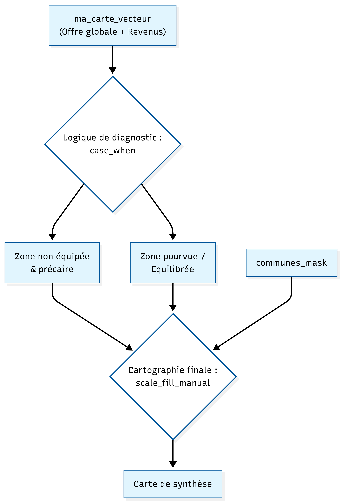

<br>
<div style="text-align: justify; color: #2c3c50; line-height: 1.6;">
La carte de synthèse territoriale constitue l'aboutissement analytique de ce travail. Pour ce faire, nous avons croisé l'indice d'offre globale d'équipements (la somme des dotations en services culturels, de santé et d'enseignement) avec le niveau de revenu médian par carreau issu des données Insee Filosofi. Cette approche par lissage raster permet d'apporter une réponse spatialisée à la problématique en identifiant les configurations territoriales où l'absence de services aggrave la situation sociale des habitants.
</div>
<br>

```{r chargement_donnees_secours, include=FALSE}
library(tidyverse)
library(sf)

#je suis fatiguée
ma_carte_vecteur <- st_read("carreaux_200m.geojson") 
communes_osm <- st_read("limites_etude.geojson")
communes_mask <- st_transform(communes_osm, st_crs(ma_carte_vecteur))

```


```{r calcul_indice_propre, message=FALSE, warning=FALSE}

if(!"sante" %in% colnames(ma_carte_vecteur)) ma_carte_vecteur$sante <- 0
if(!"enseignement" %in% colnames(ma_carte_vecteur)) ma_carte_vecteur$enseignement <- 0
if(!"culture" %in% colnames(ma_carte_vecteur)) ma_carte_vecteur$culture <- 0

# SVP R FONCTIONNE y'a pas d'erreur dans ma ligne là 
ma_carte_vecteur <- ma_carte_vecteur %>%
  mutate(offre_globale = coalesce(sante, 0) + 
                         coalesce(enseignement, 0) + 
                         coalesce(culture, 0))

```

```{r raster_social_final_osm, message=FALSE, warning=FALSE}

library(stars)
library(ggplot2)
library(viridis)

communes_mask <- st_transform(communes_osm, st_crs(ma_carte_vecteur))

raster_data <- st_rasterize(ma_carte_vecteur["ind_snv"], nx = 600, ny = 600)
raster_df <- as.data.frame(raster_data, xy = TRUE)
colnames(raster_df) <- c("x", "y", "valeur")

```


```{r raster_revenus_calcul, results='hide', fig.show='hide'}


ggplot() +
  geom_raster(data = raster_df, aes(x = x, y = y, fill = valeur)) +
  
  geom_sf(data = communes_mask, fill = NA, color = "grey30", size = 0.05, alpha = 0.4) +
  
  scale_fill_viridis_c(
    option = "magma",
    name = "Niveau de vie (€)",
    na.value = "transparent",
    labels = function(x) paste0(format(x, big.mark = " ", scientific = FALSE), " €")
  ) +
  coord_sf() + 
  theme_void() + 
  theme(
    plot.title = element_text(size = 12, face = "bold", hjust = 0.5),
    plot.subtitle = element_text(size = 10, hjust = 0.5, margin = margin(b = 10)),
    legend.position = "right",
    plot.caption = element_text(size = 7, color = "gray50", hjust = 0.9)
  ) +
  labs(
    title = "Distribution spatiale du niveau de vie",
    subtitle = "Synthèse par lissage raster et limites communales",
    caption = "Source : Insee Filosofi & OpenStreetMap"
  )

```


```{r carte_alerte_finale, message=FALSE, warning=FALSE}
library(tidyverse)
library(sf)

ma_carte_vecteur <- ma_carte_vecteur %>%
  mutate(priorite = case_when(
    (offre_globale == 0 | is.na(offre_globale)) & ind_snv < median(ind_snv, na.rm=T) ~ "Zone non équipée et précaire",
    (offre_globale == 0 | is.na(offre_globale)) ~ "Zone non équipée de structures (santé, sociale, culturelle, scolaire)",
    ind_snv < median(ind_snv, na.rm=T) ~ "Besoin d'appui social",
    TRUE ~ "Zone pourvue / Equilibrée"
  ))

# La Carte turn pretty please ?! 
ggplot() +
  geom_sf(data = communes_mask, fill = "gray95", color = "white") +
  geom_sf(data = ma_carte_vecteur, aes(fill = priorite), color = NA) +
  scale_fill_manual(
    values = c(
      "Zone non équipée et précaire" = "#D90429",
      "Zone non équipée de structures (santé, sociale, culturelle, scolaire)" = "#F77F00",
      "Besoin d'appui social" = "#FFD60A",
      "Zone pourvue / Equilibrée" = "#8BC34A"
    ),
    name = "Diagnostic",
    labels = function(x) str_wrap(x, width = 40) 
  ) +
  labs(
    title = "Synthèse Territoriale : Accessibilité et Équité",
    subtitle = "Croisement de l'offre globale d'équipements et du niveau de vie",
    caption = "Sources : INSEE, OSM | Analyse : 2026",
    x = NULL, y = NULL
  ) +
  theme_void() +
  theme(
    legend.position = "bottom", 
    legend.direction = "vertical",
    plot.title = element_text(face = "bold", size = 12),
    legend.text = element_text(size = 7) 
    # SVP FONCTIONNE 
  )
```

<br>
Schéma de géotraitement : Synthèse Territoriale 


<br>
<div style="text-align: justify; color: #2c3c50; line-height: 1.6;">
<p style="text-indent: 30px;">
Les zones identifiées en rouge, qualifiées de « non équipées et précaires », révèlent les points de rupture les plus critiques du territoire. Elles cumulent une double vulnérabilité caractérisée par une absence quasi-totale d'équipements de proximité et des revenus inférieurs à la médiane. Localisées principalement en périphérie orientale de Clermont-Ferrand et dans certains secteurs de transition avec Gerzat, ces poches de « double peine » marquent des espaces où la faiblesse des ressources économiques des ménages se conjugue à une desserte insuffisante, sans que la mobilité individuelle puisse nécessairement compenser ce déficit. À l'inverse, les zones orange désignent des espaces résidentiels « non équipés mais sans précarité avérée ». Ce profil, très présent dans certaines extensions pavillonnaires de Gerzat, illustre la distinction fondamentale entre une inégalité d'accès objectif et une inégalité vécue : ici, les habitants disposent généralement des ressources nécessaires pour pallier l'éloignement des services par l'usage de la voiture individuelle. Enfin, le diagnostic confirme la persistance d'un gradient socio-spatial structurant au profit du centre et de l'ouest clermontois, où la forte dotation en équipements coïncide avec des niveaux de revenus supérieurs.
</p>

<p style="text-indent: 30px;">
En conclusion, cette étude démontre que l'accessibilité au sein de la métropole clermontoise et de sa première couronne est une réalité à deux vitesses. Si l'enseignement assure encore un maillage de cohésion grâce à la continuité du service public, les sphères de la culture et de la santé demeurent fortement polarisées, créant une dépendance fonctionnelle majeure pour les communes périphériques comme Gerzat.
</p>

<p style="text-indent: 30px;"> 
Le diagnostic final souligne que la proximité physique ne garantit pas l'équité : l'enjeu des politiques publiques de demain ne sera pas seulement de construire de nouveaux équipements fixes, mais de garantir que les zones les plus vulnérables bénéficient de solutions de mobilité innovantes ou de services itinérants. Briser ce cycle d'isolement géographique et social est la condition sine qua non pour transformer la ville-centre en une métropole réellement inclusive, où la dotation en services publics devient un véritable levier de rééquilibrage territorial.
</p>
</div>

<br> <br> 

<p style="text-indent: 30px;"> 
Conclusion de l'étude: 
</p>

<div style="text-align: justify; color: #2c3c50; line-height: 1.6;">
<p style="text-indent: 30px;"> 
Cette étude s'était donnée pour objectif d'interroger la nature de l'interface entre Clermont-Ferrand et Gerzat en questionnant si la frontière administrative cristallisait une rupture socio-spatiale ou s'effaçait derrière un continuum métropolitain. Au terme de l'analyse, la réponse s'avère nécessairement nuancée. Sur le plan topographique et morphologique, la limite communale ne coïncide pas avec une discontinuité physique majeure car la plaine de la Limagne prolonge sans rupture brutale le tissu urbain vers le nord-est. La lecture par réflectance satellitaire confirme d'ailleurs l'existence d'une zone tampon agricole et industrielle qui maintient une certaine discontinuité du bâti sans pour autant suivre exactement le tracé administratif. De même, sur le plan socio-économique, le gradient de revenus révélé par le carroyage Filosofi s'organise selon un axe est-ouest qui transcende les limites communales, Gerzat s'inscrivant dans une zone de revenus intermédiaires en continuité relative avec les secteurs nord-est de Clermont-Ferrand.
</p>

<p style="text-indent: 30px;">
C'est sur le plan fonctionnel de l'accès aux équipements que la frontière produit les effets les plus tangibles. L'analyse par zones tampons a mis en évidence un gradient d'accessibilité culturelle nettement défavorable à Gerzat, alors que l'enseignement bénéficie d'un maillage plus équitable. Ce travail comporte toutefois des limites méthodologiques liées au secret statistique des données Insee pour les zones peu denses, à la complétude variable de la base OpenStreetMap et à la simplification analytique de l'indice d'offre globale. Pour enrichir ces résultats, l'intégration de données de mobilité domicile-travail ou une analyse diachronique sur plusieurs millésimes permettraient de mieux saisir les dynamiques d'évolution du gradient social.
</p>

<p style="text-indent: 30px;">
En somme, la frontière entre Clermont-Ferrand et Gerzat n'est ni une rupture franche ni une ligne transparente. Elle opère de manière sélective, invisible dans la morphologie et les revenus mais perceptible dans la distribution des équipements, ce qui en fait un objet géographique pertinent qui justifie de continuer à interroger les logiques profondes structurant nos territoires.
</p>
</div>
<br> <br>
MERCI DE NOUS AVOIR LUS !!

